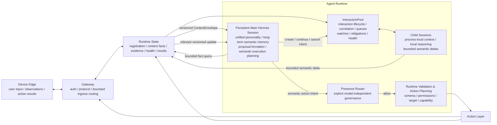
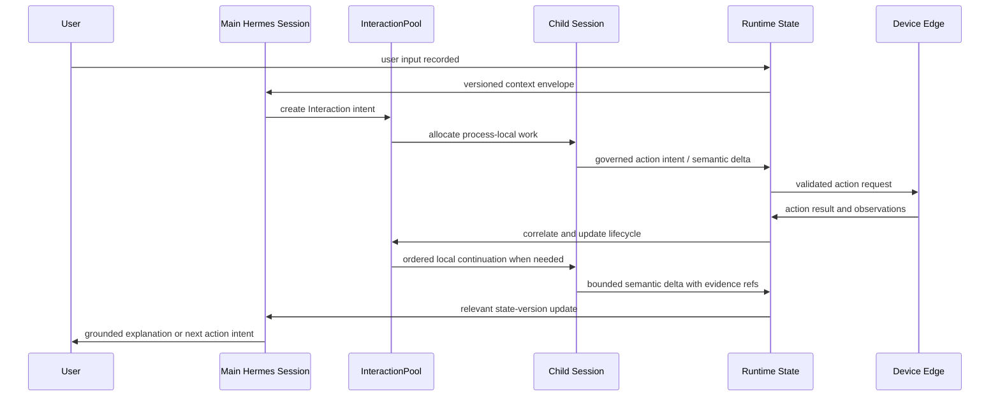

# Main Hermes And Parallel Interaction Runtime Design

Date: 2026-08-09

Status: Accepted target architecture; registration-driven context admission
updated 2026-08-23; implementation tracked by [issue #17](https://github.com/nwomn/openhalo/issues/17).

## Purpose

Define how OpenHalo keeps one continuous agent personality and semantic memory
while safely running many long-lived interactions in parallel. This design
replaces neither `InteractionPool` nor Runtime authority. It makes the
persistent Main Hermes Session the semantic center of `Agent Runtime`, while
Runtime remains the structured reality/state memory and execution boundary.

## Core Decision

`Main Hermes Session` spans the semantic path that was previously described as
separate Proposal Formation and Execution Planning model work. It maintains
continuous user-facing personality, long-term semantic memory, process
understanding, proposal formation, action-intent formation, and result
interpretation.

`InteractionPool` remains the sole lifecycle manager for individual
interactions. It creates and schedules process-local Child Sessions as needed
so Coding, device verification, observation, and other long-horizon work do
not expand the Main Session context without bound.

`RuntimeState` remains authoritative for facts, state versions, evidence,
health, obligations, action correlation, permissions, and execution outcomes.
It does not independently act as a mechanical conversational agent. All
user-visible explanation and semantic execution intent pass through Main
Hermes.

`Presence Router` remains explicit and model-independent. It is a Runtime
governance gate between semantic intent and user-visible or external action.

## Target Layout



## Authority And Responsibilities

| Concern | Authority | Constraint |
| --- | --- | --- |
| Device facts, action results, evidence, health | Runtime State | Models cannot overwrite facts. |
| Interaction lifecycle, correlation, queues, watches | InteractionPool | One interaction is ordered internally; unrelated interactions may run concurrently. |
| User intent, personality, semantic interpretation, proposal, action intent, result explanation | Main Hermes Session | Must use a versioned Runtime projection and may not claim absent facts. |
| Long-horizon local process reasoning | Child Session | No competing user personality or independent global memory. |
| Intervention timing, surface, intensity | Presence Router | Explicit, inspectable, model-independent gate. |
| Schema, permission, target/capability validation and side effects | Runtime validation / Action Layer | Main Hermes proposes; Runtime validates and executes. |

## Concurrency Model

Gateway ingress must be short and non-blocking. It validates and persists a
frame, then routes it to a bounded scheduler; it must not hold a global lock
while a Hermes turn is running.

- An Interaction has one ordered mailbox/worker for its correlated events.
- Different Interactions may run concurrently.
- User-originated Main Session work has priority over background observation
  continuation work.
- High-frequency observations are coalesced by interaction and state version;
  obsolete progress does not require one Hermes turn per frame.
- Action-result ordering remains exact through `(interaction_id,
  interaction_turn_id, request_id)` correlation.
- Runtime may update the factual state of an existing Interaction immediately
  without waiting for Main Hermes. Main Hermes is awakened only for a relevant
  semantic delta: a user request, meaningful progress, completion, failure,
  health transition, ambiguity, or an action decision.

## Context And Memory Contract

Sessions do not share complete transcripts. Runtime owns a canonical
structured state, and a harness-internal Context Compiler turns relevant state
into bounded model-facing context.

### Runtime Fact State

Runtime persists the complete structured record, including:

- lifecycle phase, health, obligations, and state version;
- confirmed facts versus hypotheses and uncertainty;
- structured process results such as artifacts, commands, test outcomes, and
  evidence references;
- exact ActionBatch/action-result lineage; and
- bounded raw observation and evidence records.

### Registered Edge Context Admission

Device capability registration is also Main Hermes context admission. Every
schema-valid, accepted Observation from a registered Edge must automatically
produce a generic, provenance-bearing Runtime context fact; adding a new Edge
or Observation name must not require a device-specific snapshot reducer or
fixed Runtime prompt rule. The shared mechanism applies the registered schema,
latest-state replacement, declared freshness, bounded value/byte limits,
provenance, and a generic `unknown` result for stale or unavailable facts.

The Context Compiler includes these current registered facts in Main Hermes's
bounded `ContextEnvelope` and exposes bounded Runtime-owned fact queries for
additional detail. High-frequency equivalent reports are coalesced; only a
meaningful fact-state delta wakes Main Hermes. This is not permission for raw
media or unbounded payloads: such data must remain outside the ordinary
Observation contract and behind explicit evidence retrieval. Presence Router
continues to govern whether a perceived fact may cause a user-facing action.

#### Replacement Data Flow

The refactor replaces the current per-name mapping:

```text
fixed observation name -> fixed compact-snapshot field -> prompt
```

with one Runtime-owned, device-neutral pipeline:

```text
registered Observation schema
  -> accepted Observation registry entry
  -> generic ContextFact table
  -> versioned ContextEnvelope
  -> persistent Main Hermes Session
```

Registration is the admission decision. An Edge does not need a later
Runtime-source edit merely because it introduces a new valid semantic
Observation. Action-only capabilities produce no fact; every accepted
Observation-provider value produces one.

#### Generic ContextFact Contract

`ContextFact` is a materialized current fact, not an unbounded event history.
Its identity is `(source_device_id, observation_name)`, so identical
Observation names reported by different Edges never overwrite each other.

```json
{
  "fact_id": "camera-edge-1/camera.person_presence.v1",
  "source_device_id": "camera-edge-1",
  "observation_name": "camera.person_presence.v1",
  "value": {"state": "present", "count": 1},
  "confidence": 0.859375,
  "observed_at": "2026-08-23T10:22:24.248688Z",
  "freshness": "fresh",
  "expires_at": "2026-08-23T10:23:24.248688Z",
  "provenance": {
    "source_capability": "camera.person_presence",
    "source_event_id": "camera-person-presence-...",
    "schema_version": "person_presence.v1"
  }
}
```

The generic materializer must:

- validate the registered schema before creating or replacing a fact;
- take freshness from registration metadata, with a documented global fallback
  rather than an Observation-name branch;
- retain a reported `unavailable` value as a fact, but expose stale facts as
  `unknown`;
- replace a current fact only with a newer accepted observation from the same
  fact identity;
- record provenance and state version for every material change; and
- reject raw media, opaque oversized values, and unregistered data before the
  fact table.

The event/observation log remains the authoritative history. A ContextFact is
the generic latest-state index that makes registered device reality available
to personality without replaying all history.

#### ContextEnvelope Contract

The Context Compiler builds Main Hermes context from the generic fact table,
not `_snapshot_field_specs()` or a device-specific field list. Each envelope
contains a bounded current-fact view, meaningful changes since the last Main
turn, and an index for on-demand fact queries:

```json
{
  "context_version": 248,
  "facts": ["bounded current ContextFact values"],
  "changed_facts": ["semantic fact-state changes since Main Hermes processed version 247"],
  "fact_sources": ["registered device and Observation identities"],
  "uncertainty": ["stale, unavailable, conflicting, or omitted facts"]
}
```

All registered facts are therefore normally perceptible to OpenHalo
personality. Bounded prompt construction may summarize stable facts, but must
preserve a fact-source index and Runtime-owned query path; it must not make an
unmapped new Edge invisible. Repeated heartbeats that do not alter the
material fact update freshness/provenance only and do not create a new Main
Hermes wakeup.

#### Migration From Fixed Compact Snapshots

The migration is deliberately generic:

1. Extend the registration contract with optional fact freshness metadata and
   add the persisted `ContextFact` table/index.
2. Materialize facts for every accepted registered Observation at Gateway
   ingress, with one common schema/size/provenance implementation.
3. Introduce a versioned `ContextEnvelope` compiler and bounded fact-query
   interface for Main Hermes.
4. Move normal user-query grounding to `ContextEnvelope`; a newly registered
   Observation must be visible without Runtime source changes.
5. Retain the existing fixed compact snapshot only as a temporary compatibility
   projection for already-shipped Presence rules, then retire it from
   personality context.
6. Let semantic fact changes coalesce into Main Hermes wakeups; Presence Router
   separately decides whether a perceived change may become a proactive action.

This migration must not add camera, phone, Coding, or any other Edge-specific
branches to Runtime context compilation.

### Child Session Context

A Child Session receives only the objective, local process history, relevant
facts, constraints, and bounded evidence needed for its Interaction. It may
reason over detailed Coding activity or device observations, but it does not
receive or own the Main Session's complete long-term conversation.

It returns a bounded `SemanticDelta`, for example:

```json
{
  "interaction_id": "interaction-60",
  "base_state_version": 163,
  "event": "process_completed",
  "summary": "括号匹配实现已创建并通过测试。",
  "proposed_result": {
    "artifacts": ["bracket_matching.py", "test_bracket_matching.py"],
    "command": "python -m unittest discover -v",
    "test_summary": "5 tests passed"
  },
  "evidence_refs": ["coding-evidence://interaction-60/80"],
  "confidence": 1.0
}
```

Runtime validates provenance, evidence and version before promoting eligible
fields into authoritative `process_state.result`. A Child conclusion without
sufficient evidence remains a hypothesis or uncertainty, not a fact.

### Main Session Context

Main Hermes receives a small `ContextEnvelope`, not a serialized Runtime
database record or Child transcript. It contains, in priority order:

1. the current user request or semantic event;
2. the relevant confirmed process facts and their state version;
3. current registered-Edge context facts and only the newest meaningful delta;
4. unresolved uncertainty, obligations, and permitted claims;
5. evidence references that may be queried on demand.

For example, a user asking for a Coding result should receive a concise model
briefing such as:

```text
Current request: What was the result of the Coding task?
Confirmed process: interaction-60, completed, state version 164.
Result: bracket_matching.py and test_bracket_matching.py created;
python -m unittest discover -v ran successfully; 5 tests passed.
Evidence: coding-evidence://interaction-60/80.
Uncertainty: none.
```

The complete structured state remains queryable through bounded Runtime-owned
tools when Main Hermes needs details. It is never dumped into every prompt.

## Main And Child Session Flow



## Non-Negotiable Rules

- Main Hermes does not bypass Presence, Runtime validation, Action Layer, or
  evidence checks.
- Runtime does not independently compose user-facing fallback answers; it
  records and constrains reality for Main Hermes.
- Main Hermes does not receive every event frame or every Child transcript;
  it receives the current generic facts derived from all accepted registered
  Observations, plus bounded semantic deltas and queries for detail.
- A model cannot claim files, commands, test results, completion, or health
  states that are absent from the current Runtime projection or permitted
  evidence query result.
- A Child Session cannot become a second persistent user personality.
- No Coding-, camera-, or device-specific top-level process lifecycle is
  created; all such work remains an InteractionPool-managed Interaction.

## Acceptance Direction

The implementation acceptance for issue #17 must prove all of the following:

1. A background Coding Interaction does not block a new normal user request.
2. Multiple unrelated Interactions progress concurrently while each preserves
   ordered local turns and exact result correlation.
3. Main Hermes retains one stable session identity and continuous semantic
   memory across user queries and process updates.
4. Child-to-Main projection is bounded, versioned and evidence-backed.
5. A user can ask Main Hermes for the current status or final result of a
   process and receive an answer grounded in Runtime facts.
6. High-frequency observations are coalesced and cannot create an unbounded
   Main or Child Hermes wakeup backlog.
7. Presence Router and Runtime Action governance remain explicit and intact.
8. A newly registered, schema-valid Observation from an otherwise unknown Edge
   becomes visible to a normal Main Hermes user query without a Runtime
   Observation-name code change.
9. Two Edges reporting the same Observation name remain separately queryable;
   stale and `unavailable` states are reported truthfully rather than as the
   last fresh value.
10. The real MaixCAM `camera.person_presence.v1` fact is visible to a phone
    query as its latest semantic state, with no raw image upload and no
    automatic intervention unless Presence later permits one.

## Relationship To Existing Architecture

This is an evolution inside `Agent Runtime`, not a new top-level lifecycle or
a change to the `Device Edge -> Gateway -> Personal Runtime` boundary. The
existing `InteractionPool`, `Presence Router`, Runtime validation, Action
Layer, and Edge API remain. Proposal Formation and semantic Execution Planning
become phases of the persistent Main Hermes semantic loop; their deterministic
Runtime validation and action-dispatch portions remain separate mechanical
boundaries.
