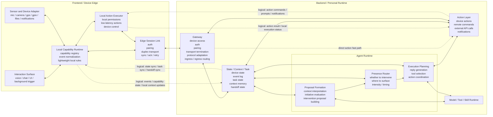
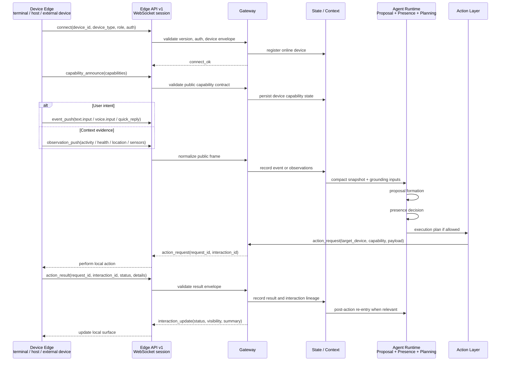
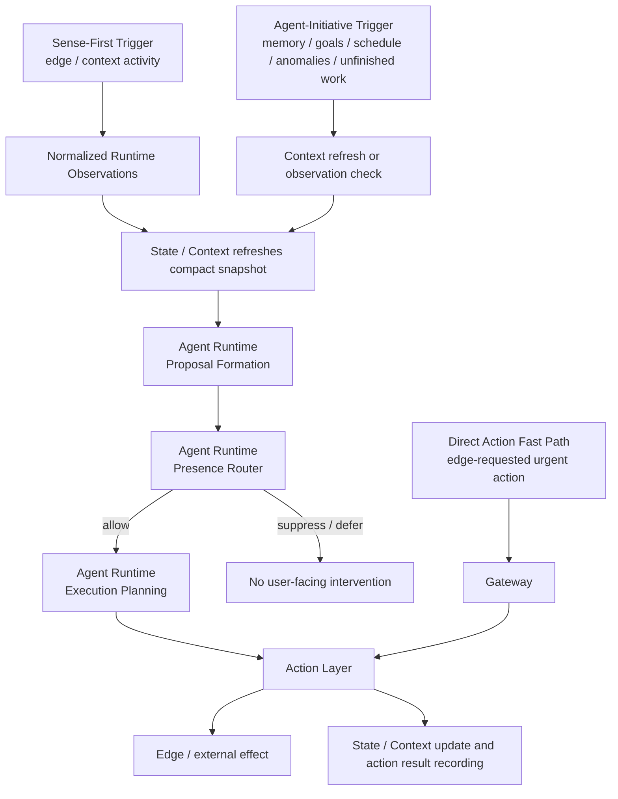

# Personal Runtime Architecture Baseline

Date: 2026-06-16
Status: Working design baseline

## Purpose

This document captures the current high-level architecture for the personal runtime project.

It is intended to make three boundaries explicit:

- What belongs to `Frontend / Device Edge`
- What belongs to `Backend / Personal Runtime`
- What `Gateway` should and should not own

This is a design baseline, not a final implementation spec.

## Canonical Architecture Diagram

This diagram is the current reference diagram for the agreed frontend/backend split, internal component layout, and cross-boundary communication rule.

If later discussions produce alternative sketches, this diagram should remain the baseline until it is intentionally replaced by a newer accepted version.

## Edge API Interaction Flow

This diagram makes the `M17.0` API boundary explicit. Device edges use the public Edge API to connect, announce capabilities, push user events or observations, receive runtime actions, return action results, and receive interaction status updates. Runtime internals stay behind `Gateway`.

## Runtime Decision Flow

This diagram complements the module diagram above. The module diagram shows ownership and boundaries. This flow diagram shows how the runtime enters proactive decision-making and how both proactive entry paths converge on the same explicit presence gate inside `Agent Runtime`.

## Core Interpretation

The frontend is not a thin UI client. It is a device-resident edge runtime.

That edge runtime may live on a personal device or on a host-class node such as the cloud server that runs the personal runtime, as long as the host-side edge still behaves like an explicit edge participant rather than a hidden backend shortcut.

For the first host-class edge slice, the preferred control boundary is broad observation of host state but narrow actuation limited to the personal runtime's own process or service lifecycle.

That actuation surface should be expressed as a stable edge capability contract, with deployment-specific execution delegated to replaceable backend adapters such as a plain Python-process controller first and a `systemd` controller later.

For this first host-edge slice, the edge should still run as an explicit frontend-side daemon independent from the backend runtime process, even when both live on the same host. That separation keeps restart initiation, post-restart health observation, and transport boundaries legible.

The backend is not a traditional request-response application server. It is the long-lived personal runtime that maintains continuity across devices, tasks, and contexts.

The gateway is part of the backend, but it is not the system brain. It is the controlled boundary through which edge nodes connect to the runtime.

## Frontend / Device Edge

### Interaction Surface

This is where the user or environment actually touches the system.

Examples:

- voice interaction
- chat or text input
- visible UI
- notifications
- wake-word or background triggers

### Sensor and Device Adapter

This layer talks to hardware or platform APIs directly.

Examples:

- microphone
- camera
- GPS
- local file system access
- GPIO or relay control
- OS notifications

### Local Capability Runtime

This is the key frontend unification layer.

Responsibilities:

- expose device capabilities in a normalized form
- convert raw local signals into normalized events
- maintain the local capability registry
- apply lightweight local rules when needed
- shield the rest of the system from device-specific API differences

This is where the `Device` plus `Capability` abstraction starts to become concrete.

### Local Action Executor

This layer performs actions that should happen on the device itself.

Examples:

- display a local notification
- start local recording
- toggle a relay
- perform a low-latency UI or device action

### Edge Session Link

This is the frontend's only network-facing cross-boundary channel to the backend.

Responsibilities:

- pairing
- authentication
- long-lived duplex transport
- delivery acknowledgements
- retry and reconnect behavior
- synchronization envelopes

Even when a host-side edge is physically co-located on the same server as the backend runtime, this boundary should remain explicit so the architecture does not collapse into direct internal module coupling.

## Backend / Personal Runtime

### Gateway

This is the backend boundary layer.

Responsibilities:

- terminate edge connections
- authenticate and pair devices
- adapt protocol differences
- validate and route ingress and egress messages
- expose a stable control-plane boundary for all edge participants

The gateway should stay transport-oriented and control-plane-oriented.

### State / Context / Task

This is the runtime truth center.

Responsibilities:

- maintain device state
- store normalized event history
- maintain task state
- maintain context memory
- maintain handoff and continuity state across devices

### Agent Runtime

This is the primary intelligent backend module.

Responsibilities:

- interpret compact context and supporting evidence
- form intervention proposals from edge/context activity or agent initiative
- hold an explicit `Presence Router` governance submodule before user-facing intervention
- continue into execution planning only after presence allows intervention
- select tools, generate responses, and coordinate action requests

#### Presence Router

This internal governance submodule decides how the runtime should show up.

Responsibilities:

- decide whether the system should intervene
- choose the target device or surface
- choose timing and intensity of intervention

This is one of the biggest differences from a channel-first agent architecture.

#### Proposal Formation And Execution Planning

Before presence gating, `Agent Runtime` may form intervention proposals from compact context, memory, goals, schedules, anomalies, and unfinished work.

After presence allows intervention, that same module may continue into execution planning, tool selection, response generation, and action coordination.

### Action Layer

This layer turns decisions into effects.

Responsibilities:

- invoke edge actions
- invoke remote commands
- call external APIs
- issue notifications
- write execution results back into runtime state

### Model / Tool / Skill Runtime

This is the execution substrate used by `Agent Runtime`.

Examples:

- model providers
- tool hosts
- skill runtimes
- safety or policy wrappers

## Cross-Boundary Rule

This is an explicit architecture rule:

- All physical cross-boundary communication must pass through `Edge Session Link <-> Gateway`

This means frontend modules do not directly network-connect to backend internal modules, and backend internal modules do not directly network-connect to frontend internal modules.

The dashed arrows in the diagram represent logical producer-consumer relationships, not direct transport links.

Examples:

- `Local Capability Runtime -> State / Context / Task` means capability events are logically consumed by state management, but they still travel physically through `Edge Session Link -> Gateway`
- `Action Layer -> Local Action Executor` means action requests are logically consumed by local executors, but they still travel physically through `Gateway -> Edge Session Link`

This rule is intended to prevent protocol sprawl and keep the architecture understandable.

## Gateway Scope

### Gateway should own

- device pairing
- authentication and trust checks
- transport lifecycle management
- protocol adaptation
- ingress and egress routing
- acknowledgement, retry, and delivery envelope mechanics
- basic validation and message normalization
- connection-level observability

### Gateway should not own

- long-term task truth
- context reasoning
- presence decisions
- agent planning
- semantic interpretation of user state
- business-level action orchestration

In short:

- `Gateway` is a boundary and control-plane layer
- `Personal Runtime` is the stateful decision and execution core

## Allowed Gateway Preprocessing

Gateway preprocessing should remain protocol-level, not semantic.

Reasonable examples:

- schema validation
- message envelope normalization
- attachment metadata handling
- auth-derived device identity enrichment
- deduplication using delivery IDs
- retry classification

Gateway preprocessing should not cross into runtime reasoning.

Not acceptable as gateway responsibilities:

- deciding whether an event is important to the user
- deciding which device should surface a response
- deciding whether a task should be created
- running agent planning logic

## Edge Representation Rules

Current agreed direction:

- Represent every edge participant as a `Device`
- Expose runtime-facing functions as `Capabilities`
- Classify profiles primarily by role
- Describe hardware family as secondary metadata
- Keep role vocabulary intentionally small
- Reuse existing roles for new device classes whenever possible
- Defer heavy resource-tier scheduling design until it becomes a real bottleneck

## OpenClaw Reuse Stance

Current agreed direction:

- Do not plan around direct reuse of the OpenClaw gateway server surface for implementation
- Keep the personal runtime on its own minimal gateway path now that a working protocol, edge client, and gateway baseline already exist
- Retain OpenClaw protocol and client layers only as optional reference material for future hardening or selective design borrowing

This avoids pulling channel/session-centered assumptions into the new runtime architecture.

## Immediate Implications For v0

The first implementation milestone should probably prove these points in the smallest possible way:

- one edge client can pair with the backend
- the edge client can register device identity and capabilities
- normalized events can reach runtime state
- the backend can issue one action command back to the edge
- the full round-trip uses only `Edge Session Link <-> Gateway` as the physical cross-boundary path

## Still Open

This document does not yet finalize:

- the first-class object for implementation sequencing
- the minimum state model fields
- the minimal role vocabulary
- the first v0 device surfaces
