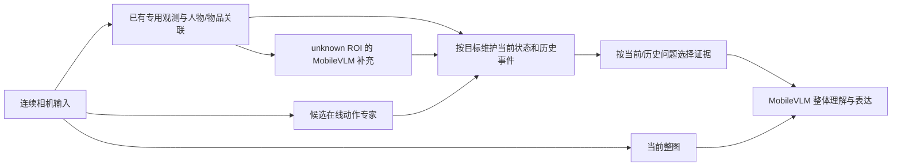

# Camera Edge：专用模型＋MobileVLM V2 的时序理解调研

日期：2026-09-13。范围：公开原始论文、作者项目页及代码说明；本轮未下载模型、运行设备实验或实现新管线。以下优先级是研究建议，不是已批准的实施顺序或验收结果。

## 结论与当前缺口

保留用户认定的当前最可行候选：多个低层专用模型＋unknown ROI 的 MobileVLM V2 补充＋整体理解/自然语言表达。相关研究支持从两个方面扩展：**增加学习到的在线动作特征；将对象状态和事件组织为有明确时间与证据的记忆。** 两者可以分别做消融实验。

现有实验已有四秒手势变化、有限挥手规则、异步去重和描述缓存，但不是完整动作理解。实际失败包括历史 Thumb_Up 覆盖当前 Victory、手离开后仍描述举手、螺丝刀错误描述进入并传播出缓存。参考[整体描述实验](../ops/jetson-specialist-context-validation.md)、[时序几何实验](../ops/jetson-specialist-temporal-validation.md)、[异步调度实验](../ops/jetson-roi-singleflight-validation.md)。

## 值得借鉴的研究

| 研究 | 原研究做法与证据边界 | 对现方案的用途与代价 |
| --- | --- | --- |
| **TSM，ICCV 2019** | 沿时间交换部分视觉特征；作者有 MobileNetV2＋Jester 在线手势模型及 Jetson Nano 演示 | 最具体的轻量动作专家候选。给多模型系统增加运动信息；Jester 手势权重不等于吃东西、拿起/放下模型，需要检查类别和域差异，必要时训练。旧部署工具链也需适配 |
| **TeSTra，ECCV 2022** | 以流式注意力复用计算，建模短时变化和长历史；官方提供代码、检查点入口及预提取 RGB/光流特征流程 | 适合进一步研究在线动作持续与变化。现有 JSON 不能直接喂给其原权重；替换为我们的关键点/ROI特征需训练，视觉特征提取成本必须计入 |
| **VideoAgent，ECCV 2024，Fan 等** | 结合时序事件描述与对象跟踪记忆，再用工具检索视频证据；原实现用 GPT-4 作主 LLM | 借鉴“同一物品在哪些时刻出现、发生哪些事件”。原系统是长视频问答，不能当 Jetson 实时方案；注意与其他同名 VideoAgent 论文区分 |
| **D-HSM，2026-08-31 arXiv v1** | 冻结 VLM，将历史组织为实体及带时间的关联证据，近期保留视觉输入，按问题选择历史；实验骨干为 7B/8B，耗时在 A100 测量 | 很贴合历史污染当前的问题。借鉴当前状态/历史检索分离；其描述相似度实体关联并非可靠身份跟踪，论文也承认记忆错误传播。没有 MobileVLM 1.7B 的直接效果证明 |
| **EventMemAgent，2026-02 arXiv** | 短期事件边界与采样、长期事件档案、按需工具取证；论文包含 8B 模型与 GRPO 训练 | 借鉴按事件保存证据、必要时回看片段。完整系统不是轻量即插即用组件，本轮不建议照搬训练/Agent链 |
| **VideoLLaMB，ICCV 2025；预印本始于2024** | 在视觉到语言的桥接层中学习循环记忆 token，并做语义片段划分 | 更直接改变模型的时间表示，但需要模型改造、视频训练及兼容验证。论文7B/A100设置不能移植为我们1.7B/Jetson的性能承诺，列为较远期方向 |

以上都是已有研究，不是我们已复现的能力。特别是“冻结VLM/免训练”不保证换成更小模型后仍有效；“在线”也不等于我们要求的事件产生到有效答案的五秒 P95。

原始来源与可复现入口（已核对网页；本轮没有检验权重下载完整性）：

- TSM：[论文](https://arxiv.org/abs/1811.08383)、[作者代码](https://github.com/mit-han-lab/temporal-shift-module)、[Jetson在线演示说明](https://github.com/mit-han-lab/temporal-shift-module/blob/master/online_demo/README.md)。演示的实际输入是连续图像，不是静态手势类别列表。
- TeSTra：[论文](https://arxiv.org/abs/2209.09236)、[作者代码与特征/训练/stream说明](https://github.com/zhaoyue-zephyrus/TeSTra)。流式时间模型的开销与整条图像管线的开销需分别报告。
- VideoAgent：[论文全文](https://arxiv.org/html/2403.11481v2)、[作者项目页](https://videoagent.github.io/)。对象记忆和事件记忆可作为设计参考，论文成绩不用于推算本机收益。
- D-HSM：[论文全文](https://arxiv.org/html/2608.30294v1)、[作者项目页](https://oshikaka.github.io/DHSM/)。重点参照记忆更新、当前问题跳过历史检索、失败分析与限制章节。已核对的是论文和项目页，不声明完成代码可复现性审计。
- EventMemAgent：[论文全文](https://arxiv.org/html/2602.15329v1)。重点参考事件边界与按需取证；本轮未核对完整代码/权重交付状态。
- VideoLLaMB：[正式论文](https://www.openaccess.thecvf.com/content/ICCV2025/papers/Wang_VideoLLaMB_Long_Streaming_Video_Understanding_with_Recurrent_Memory_Bridges_ICCV_2025_paper.pdf)、[作者代码](https://github.com/bigai-nlco/VideoLLaMB)。记忆桥接本身需要学习，不能把片段划分的免额外训练表述扩展到整个方法。

## 建议如何接入：工程推断，尚未实施

优先做两个小范围、可独立判定的改动：

1. **当前状态与事件记忆分离。** 每条记录绑定目标、源时间、有效区间、观测来源、证据引用及不确定状态。确认目标发生变化就结束当前描述的适用期；历史记录可继续回答过去的问题。面部身份与物体实例关联尚未实现/验证，不能仅以相同类别或相似描述认定同一目标。此项参考上述记忆研究，具体字段和失效规则是我们的工程建议。
2. **增加 Online TSM 动作专家作为候选基线。** 先验证预训练类别覆盖的动态手势与静止控制，再决定是否值得为拿起、保持、放下等动作采集数据训练。手消失、检测到框重叠或识别出手机，都不单独证明“放下”或“拿起”。若TSM能力/类别不合适，再考虑TeSTra式时间头；不是直接重复原先全部unknown的姿态规则。

前者主要改善信息组织和时间归属，后者才可能增加原来缺失的运动证据。两者都不能单独保证开放式过程理解；低层没观察到的接触、物体或动作，不应由语言层补成事实。若正确事件输入仍被1.7B模型误述，再评估受约束表达或模型适配，不预先认定换提示词就有效。

## 最小验证设计

在新采集且独立标注的连续片段上，冻结专用模型、VLM、采样率及生成预算，比较：

| 组别 | 改变的变量 | 要回答的问题 |
| --- | --- | --- |
| A | 当前已存方案 | 固定基线，历史覆盖与错误缓存有多少 |
| B | 仅改当前状态/事件记忆及检索 | 没有新增运动模型时，是否减少过期状态、顺序误述，并保留有用信息 |
| C | B＋候选在线动作专家 | 是否额外提高动态动作与起止/顺序识别，代价多大 |
| 诊断组 | 人工正确事件替换预测事件，独立报告 | 区分感知缺失与语言层无法忠实表达；人工输入不计入系统准确率 |

第一轮场景应包括相反顺序、同样终帧不同过程、静止与挥动、手出画面但物体状态不可见、清晰换物、遮挡后重现。多人交叉作为目标关联单独验收，不因单人通过就宣称多人通过。训练数据与最终测试片段分离，避免在测试片段上校准阈值后仍当新验收。

指标分别报告：事件级精确率/召回率与误报次数、顺序正确率、起止时间误差、串目标次数、历史误写成当前的比例、unknown与有用信息保留、语言表达忠实度。在线评估在每个时刻只允许使用已到达的观测；同终帧对照需要真实不同过程，不能仅交换文字标签。

性能必须运行真实专用模型与VLM并发负载，记录采集时间、事件证据就绪时间和最终结果可消费时间；分开计算模型耗时与端到端事件延迟，另报队列、RAM和swap。保留项目五秒live event-label P95目标；本轮调研不声明能达到。前述验收口径先于实现细化，未经实测不扩充Camera Edge或Runtime已完成状态。

## 本轮状态

已完成研究筛选与本项目适配分析；建议先比较“事件记忆分离”和“Online TSM动作专家”两种增量。未确认最终选型、未启动训练或部署；现有MobileVLM多层路线偏好与未验收状态保持不变。
